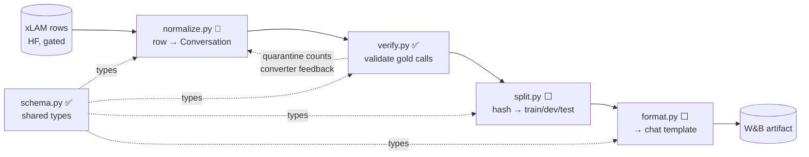
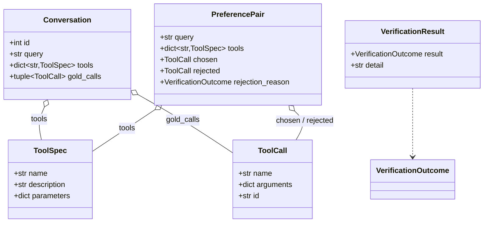

# tool-forge

Post-train a small instruction-tuned LLM for reliable multi-step **tool use**, evaluate it on the
public **Berkeley Function Calling Leaderboard (BFCL-V4)**, and serve it behind an OpenAI-compatible
API with a minimal ReAct loop — **all on a single 12 GB RTX 4070**.

Base model: **Qwen3-4B-Instruct-2507** (non-thinking, function-calling mode). The résumé artifact is a `base → SFT → aligned` BFCL accuracy table.

## The constraint drives everything

One consumer GPU. On a desktop-driving 4070, ~2 GB goes to the display, leaving **~10 GB usable**.
Every choice (QLoRA 4-bit, adapter-disabled reference model, short context, batch-size-1 + grad
accumulation) exists to fit that budget. Measured: bf16 Qwen3-4B-Instruct-2507 serving uses
**~7.64 GiB weights + ~2.5 GiB KV cache** (18.5k tokens) at `gpu_memory_utilization=0.90`,
`--max-model-len 12288`.

## Pipeline (do not reorder)

1. **Baseline** — serve the *untouched* base, run BFCL-V4, record per-category accuracy *before* any training.
2. **Data** — normalize xLAM/ToolACE to one schema, render to the chat template, validate every gold call through the verifier.
3. **SFT** — QLoRA, train-on-completions (mask prompt tokens).
4. **Alignment** — DPO (mine near-miss preference pairs) → GRPO (verifiable reward) as a stretch.
5. **Eval** — BFCL per-category + custom metrics (JSON-validity %, schema-compliance %, hallucinated-tool rate).
6. **Serve + agent** — merge adapter, serve via vLLM, run a ReAct loop.

## Architecture

The spine is `schema.py` — every module speaks its types; nothing speaks "xLAM-ese" past
`normalize`. The pure core (`schema` / `verify` / `normalize` / `split` / `format`) is I/O-free and
unit-tested; the edge (HF load, W&B, vLLM, trainers) is where side effects live.

**Data flow** (✅ built · 🔨 in progress · ⬜ planned):



`verify.py` is reused three times — Phase 1 (filter gold), Phase 3 (grade generated calls, *strict*),
Phase 5 (guard agent calls) — which is why it stays pure and dependency-free.

**Core types** (`schema.py`):



`Conversation` (SFT) and `PreferencePair` (DPO) are siblings — both carry `query` + `tools`; one holds
gold calls, the other a chosen/rejected pair.

## Results

Base model `Qwen/Qwen3-4B-Instruct-2507-FC`, **untouched**, on BFCL-V4.
Repro: greedy (`temperature=0.0`), `bfcl-eval==2025.12.17`, vLLM 0.21.0, bf16, `--max-model-len 12288`.

| Stage | Non-Live AST | Live | Multi-turn | Overall (full V4) |
|-------|-------------:|-----:|-----------:|------------------:|
| **base** | **88.31%** | **76.31%** | **17.50%** | _partial¹_ |
| + SFT     | — | — | — | — |
| + aligned | — | — | — | — |

¹ BFCL's single "Overall" blends sections not yet run (multi-turn, agentic), so it is **not**
meaningful until those land — track the section columns, not the headline. Agentic (web search,
memory) is **excluded by design** (out of training distribution; non-deterministic external services).

<details><summary>Base per-category breakdown (single-turn)</summary>

| Non-Live (hand-written) | Acc | Live (real prompts) | Acc |
|---|--:|---|--:|
| simple_python      | 95.25% | live_simple            | 78.68% |
| simple_java        | 64.00% | live_multiple          | 76.16% |
| simple_javascript  | 68.00% | live_parallel          | 62.50% |
| multiple           | 94.50% | live_parallel_multiple | 66.67% |
| parallel           | 93.00% | live_relevance         | 87.50% |
| parallel_multiple  | 90.00% | live_irrelevance       | 81.22% |
| irrelevance        | 89.17% | | |

**Reading:** already strong on Python AST (90–95%); weak on **non-Python** (`java` 64%,
`javascript` 68%) and **live parallel** calls (62–67%) — the headroom SFT/DPO must target.
</details>

<details><summary>Base per-category breakdown (multi-turn)</summary>

| Multi-turn category | Acc |
|---|--:|
| base          | 25.50% |
| miss_func     | 21.50% |
| miss_param    | 17.50% |
| long_context  |  5.50% |
| **overall**   | **17.50%** |

**Reading:** the expected difficulty gradient — `base` highest, `long_context` lowest. Stateful
multi-step execution is the hardest BFCL section for a 4B; the clean spread (not a flat near-zero)
confirms the harness is scoring real behavior. This is the biggest headroom for SFT/alignment.
</details>

## Status

- ✅ Scaffold: `uv` (Python 3.12.11), `ruff` + `mypy --strict` + `pytest`, all green.
- ✅ Pure core: `schema.py` (`ToolSpec` / `ToolCall` / `PreferencePair`), `verify.py` (JSON-Schema verifier), full tests.
- ✅ GPU verified, vLLM serving Qwen3-4B-Instruct-2507 confirmed on WSL2.
- ✅ Baseline (single-turn): Non-Live AST **88.31%**, Live **76.31%** (`Qwen3-4B-Instruct-2507-FC`, greedy).
- ✅ Baseline (multi-turn): Overall **17.50%** (base 25.50% / miss_func 21.50% / miss_param 17.50% / long_context 5.50%).
- ⬜ Phase 1 (data pipeline) → next.

## Setup

```bash
uv sync                 # core deps + dev tools (ruff, mypy, pytest)
uv run ruff check . && uv run mypy && uv run pytest
```

## Serving + baseline eval (WSL2 — separate from the training env)

vLLM is installed imperatively (not in the lockfile) because serving and training have conflicting
torch pins. The self-healing recipe lives in [`scripts/`](scripts/); run from a clean GPU:

```bash
uv pip install "vllm==0.21.0" --torch-backend auto
./scripts/serve_baseline.sh                  # terminal A: serve, wait for "Application startup complete"
./scripts/run_baseline_auto.sh single_turn   # terminal B: generate (resume loop survives WSL hangs)
./scripts/eval_bfcl.sh single_turn           # score → bfcl_scores/ (CPU-only; reads sealed gold)
```

Hard-won WSL2 pins, all encoded in `serve_baseline.sh`:

- **`vllm==0.21.0`** — 0.23 + CUDA 13 crashes on WSL2 (UVA unavailable).
- **`VLLM_USE_FLASHINFER_SAMPLER=0` and no `--kv-cache-dtype fp8`** — anything that makes vLLM
  JIT-compile a FlashInfer kernel needs `nvcc`, which isn't installed. fp8 forces FlashInfer; bf16
  KV stays on prebuilt `FLASH_ATTN`.
- **`--max-model-len 12288`** (not 4096) — BFCL reserves up to 4096 output tokens against the model's
  *native* 262K context, so the served window must hold `prompt + 4096`; 4096 overflows real prompts.
- **`--gpu-memory-utilization 0.90 --enforce-eager`** — fits bf16 weights + KV in ~10 GB usable.
- **`LD_LIBRARY_PATH` → venv `nvidia/*/lib`** — CUDA libs ship as pip wheels in the venv; after a
  WSL/shell restart the linker can't find `libcudart.so.13` until this is re-exported.
- **Reap orphans after a crash** — `vllm serve` spawns an `EngineCore` child that Ctrl-C does *not*
  kill (it keeps holding VRAM): `pkill -9 -f 'EngineCore'` (also `bin/vllm`, `bin/bfcl`).

Eval is pinned to `bfcl-eval==2025.12.17`. `--skip-server-setup` points BFCL at the running server;
greedy decoding (`--temperature 0.0`) for reproducibility. Result/score dirs use **absolute** paths
because BFCL resolves relative `--result-dir`/`--score-dir` against its *package* root, not your CWD.
**Agentic categories (web search, memory) are excluded** — they need live external services.

## Stack

Python 3.12 · `uv` · `transformers` + `trl` + `peft` + `bitsandbytes` (Unsloth backend) · `vllm` ·
`bfcl-eval` · `pydantic` v2 · `jsonschema`. Quality gates: `ruff`, `mypy --strict`, `pytest`.
