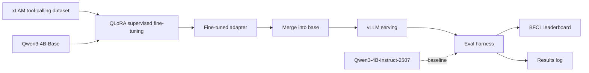

# Tool Forge

**Fine-tuning a base language model to reliably call tools — a training pipeline, an eval harness, and a portfolio project.**

[](https://www.python.org/)
[](https://pytorch.org/)
[](https://github.com/vllm-project/vllm)
[](https://wandb.ai/)
[](https://huggingface.co/Qwen/Qwen3-4B-Base)
[](https://github.com/ShishirPatil/gorilla)

> Add a demo GIF/screenshot here: a tool-call request going in, the model's structured output, the tool executing, and the final answer coming back.

## Table of contents

- [Overview](#overview)
- [Features](#features)
- [How it works](#how-it-works)
- [Quickstart](#quickstart)
- [Usage](#usage)
- [Fine-tuning](#fine-tuning)
- [Evaluation](#evaluation)
- [Appendix: experiment log](#appendix-experiment-log)
- [About](#about)

## Overview

Tool calling teaches a model to recognize when it should hand off work to another program — a search API, a calculator, a database query — instead of trying to answer from its own weights. Given a set of tool definitions, the model responds with a structured, executable call rather than free text, and the caller gets a deterministic result back.

This project fine-tunes **[Qwen3-4B-Base](https://huggingface.co/Qwen/Qwen3-4B-Base)** — a raw, non-instruction-tuned checkpoint — to perform tool calling on par with purpose-built instruct models like **[Qwen3-4B-Instruct-2507](https://huggingface.co/Qwen/Qwen3-4B-Instruct-2507)**, on a single 12 GB GPU (RTX 4070).

Two goals: build hands-on fine-tuning skill end-to-end (data → training → eval), and produce a concrete, inspectable artifact — this repo — for interviewers evaluating that skill.

## Features

- Supervised fine-tuning pipeline from a **base** (non-chat) checkpoint to reliable structured tool calls, using **QLoRA** (4-bit NF4 base + LoRA adapters) to fit a 4B model on 12 GB
- Custom eval protocol that separates *"did it even emit a parseable tool call"* from *"was the call correct"*
- Final scoring against [BFCL](https://github.com/ShishirPatil/gorilla) (Berkeley Function-Calling Leaderboard) for an external, comparable number
- Schema validation (`jsonschema`) over a pure, I/O-free core (`schema` / `verify` / `normalize` / `split` / `format`) with a `pytest` suite
- Local inference via `vLLM` (in an isolated environment) for fast batched eval runs
- Checkpoint-over-checkpoint results tracked in Weights & Biases and logged in this README's appendix

## How it works



Training data comes from the **[xLAM](https://huggingface.co/datasets/Salesforce/xlam-function-calling-60k)** tool-calling dataset, normalized to one schema and rendered to the Qwen chat template. The base model is fine-tuned on it directly — no instruction-tuning step in between — and every checkpoint is evaluated against the same protocol used on the untouched base model and on the official instruct release, so gains are attributable to the fine-tune rather than the starting checkpoint.

## Quickstart

```bash
git clone https://github.com/saltasaurus/tool-forge.git
cd tool-forge
./scripts/setup_env.sh         # training/eval env (.venv): torch, transformers, trl, peft, bitsandbytes
./scripts/setup_serve_env.sh   # isolated vLLM env (.venv-serve) for fast batched generation
```

The fast eval of a checkpoint is a three-step pipeline — merge the adapter, generate with vLLM, then score with the shared pure scorer:

```bash
# 1. fold the LoRA adapter into a standalone bf16 model
python -m tool_forge.merge --adapter runs/sft-base-v3/train --out runs/sft-base-v3/merged

# 2. generate tool-call completions over the dev split (vLLM, isolated env)
./scripts/generate_vllm.sh --model runs/sft-base-v3/merged --out runs/sft-base-v3/eval/dev.gen.jsonl

# 3. score the dump against the custom protocol (CPU, no GPU)
python -m tool_forge.eval --data data/dev.jsonl --completions runs/sft-base-v3/eval/dev.gen.jsonl
```

## Usage

Tools are described as OpenAI/Anthropic-style function schemas and passed to the tokenizer's chat template alongside the user turn:

```python
tools = [
    {
        "type": "function",
        "function": {
            "name": "get_weather",
            "description": "Get current weather for a city",
            "parameters": {
                "type": "object",
                "properties": {"city": {"type": "string"}},
                "required": ["city"],
            },
        },
    }
]

prompt = tokenizer.apply_chat_template(
    [{"role": "user", "content": "What's the weather in Austin?"}],
    tools=tools, add_generation_prompt=True, tokenize=False,
)
```

The model is trained to emit the Qwen tool-call protocol — the call wrapped in `<tool_call>` tags:

```text
<tool_call>
{"name": "get_weather", "arguments": {"city": "Austin"}}
</tool_call>
```

The eval harness checks this output at several levels — see [Evaluation](#evaluation).

## Fine-tuning

- **Base checkpoint:** [`Qwen/Qwen3-4B-Base`](https://huggingface.co/Qwen/Qwen3-4B-Base)
- **Comparison target:** [`Qwen/Qwen3-4B-Instruct-2507`](https://huggingface.co/Qwen/Qwen3-4B-Instruct-2507)
- **Dataset:** [xLAM](https://huggingface.co/datasets/Salesforce/xlam-function-calling-60k) tool-calling data
- **Method:** QLoRA — 4-bit NF4 quantized base + LoRA adapters (`r=16`), completion-only loss (prompt tokens masked). The LoRA targets attention/MLP projections **plus `lm_head` and `embed_tokens`** — the base never trained the tool-call special tokens, so the tied embedding/output head must be adapted for the model to emit the `<tool_call>` wrapper at all.
- **Stack:** [TRL](https://github.com/huggingface/trl) `SFTTrainer` + [PEFT](https://github.com/huggingface/peft) + [bitsandbytes](https://github.com/bitsandbytes-foundation/bitsandbytes) for training; `transformers` + `datasets` for models and data; `vLLM` for eval-time serving; Weights & Biases for run tracking
- **Correctness checks:** every generated call is validated against its JSON schema (`jsonschema`) before being scored; `pytest` covers the pure parsing/verification core

Train from the base checkpoint:

```bash
python -m tool_forge.train --model base --out runs/sft-base-v3/train --wandb
```

Runs are organized one directory per experiment under `runs/<run>/`: `train/` holds the trainer output (checkpoints, adapter), `eval/` holds generation dumps and metrics, `bfcl/` holds BFCL results — so a run is fully self-contained.

## Evaluation

Results below compare the untouched base checkpoint ("base floor") against a fine-tuned checkpoint. Each metric isolates a different failure mode:

| Metric | What it checks |
|---|---|
| `emits_json` | Output is a parseable tool call at all |
| `schema_valid` | Every call validates against its tool's JSON schema |
| `tool_name` | Correct tool name(s) |
| `name_and_args` | Correct tool name **and** correct arguments |
| `protocol` | Output emits the expected `<tool_call>` wrapper |
| `strict` | Wrapper present **and** the call inside it is correct |
| `hallucinated` | Model calls a tool that wasn't offered (diagnostic) |

| Metric | Base floor | v3-ckpt400 | |
|---|---|---|---|
| `protocol` (emits wrapper) | 0.00% | 73.41% | ✅ the fix |
| `strict` (wrapped + correct) | 0.00% | 47.61% | ✅ the real accuracy |
| `name_and_args` | 67.08% | 47.61% | ⚠️ down |
| `tool_name` | 87.31% | 61.03% | ⚠️ down |
| `emits_json` | 97.23% | 73.09% | ⚠️ down |
| `schema_valid` | 93.80% | 69.21% | ⚠️ down |
| `hallucinated` | 0.10% | 3.38% | ⚠️ up |

**Reading this:** the base model almost never emits a usable tool-call wrapper (`protocol` at 0%), so its higher scores on `name_and_args` / `tool_name` measure correctness only *within the rare bare-JSON calls it happens to produce* — not overall reliability. `v3-ckpt400` learns the wrapper (attempted on 100% of prompts), which is the harder and more important failure mode. But it is an early checkpoint (400 steps ≈ 0.14 epoch): on ~34% of prompts it falls into a repetition loop instead of producing one call and stopping, which drags every content metric down and lifts `hallucinated`. That degeneration tail is **undertraining**, not a precision ceiling, and is the current focus of iteration.

**BFCL score:** pending — final run not yet complete. Baseline anchors are measured (Instruct-2507 at 30.23% overall).

Full checkpoint-by-checkpoint history: [Appendix](#appendix-experiment-log).

## Appendix: experiment log

Running log of fixes and results per checkpoint, in order.

### v3 — checkpoint 400 (0.14 epoch)

First checkpoint that emits the `<tool_call>` protocol. The fix: earlier runs used a LoRA on `all-linear`, which excludes the tied `embed_tokens`/`lm_head`; because the pretrained-only base never learned the tool-call special tokens (their embedding rows sat at initialization), the frozen head could not emit them and `protocol` was pinned at 0%. Adding `lm_head`/`embed_tokens` to the LoRA unblocked it.

| Metric | Base floor | v3-ckpt400 | |
|---|---|---|---|
| `protocol` (emits wrapper) | 0.00% | 73.41% | ✅ the fix |
| `strict` (wrapped + correct) | 0.00% | 47.61% | ✅ the real accuracy |
| `name_and_args` | 67.08% | 47.61% | ⚠️ down |
| `tool_name` | 87.31% | 61.03% | ⚠️ down |
| `emits_json` | 97.23% | 73.09% | ⚠️ down |
| `schema_valid` | 93.80% | 69.21% | ⚠️ down |
| `hallucinated` | 0.10% | 3.38% | ⚠️ up |

Diagnosis: ~34% of generations degenerate into repetition loops (never emit `</tool_call>` or stop), which accounts for the depressed content metrics. Next lever is more training from this checkpoint.

_(Additional checkpoints will be appended here as training progresses.)_

## About

Built by [**saltasaurus**](https://github.com/saltasaurus) to learn model fine-tuning end-to-end and as a portfolio piece for ML/infra interviews.

- Repo: [github.com/saltasaurus/tool-forge](https://github.com/saltasaurus/tool-forge)
- Base model: [Qwen3-4B-Base](https://huggingface.co/Qwen/Qwen3-4B-Base)
- Comparison model: [Qwen3-4B-Instruct-2507](https://huggingface.co/Qwen/Qwen3-4B-Instruct-2507)
